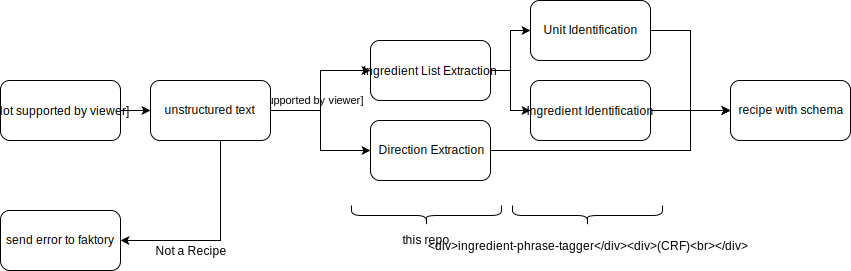

## rbk processor
### extract recipes from unstructured text

This repo contains the code/data for building models for rbk (better name tbd)




#### Local Usage

```
pip install -r requirements.txt # you should set up a virtualenv - this repo was developed using python 3.6.14
cd data; python cleaner.py; python generate_training_data.py; cd -
python trainer.py
```

You should see the results from the tests in your terminal, and have the different models in your `data/{ingredients, directions}` dirs

*Note:* Either there is a bug or my test data isn't sufficient, some of the models are scoring >99%

TODO: 
- [ ] add proper attribution and licensing
- [ ] \(low effort) support reloading pickled model files instead of rebuilding them every run
- [ ] test if its necessary to have a classifier at the start of the pipeline for determining if a document contains a recipe
- [ ] add docstrings
- [ ] there is some implicit structure in recipes: ingredients and directions are generally right next to eachother, and ingredients are generally listed before directions. Worth exploring techinques that utilize this implicit structure.


